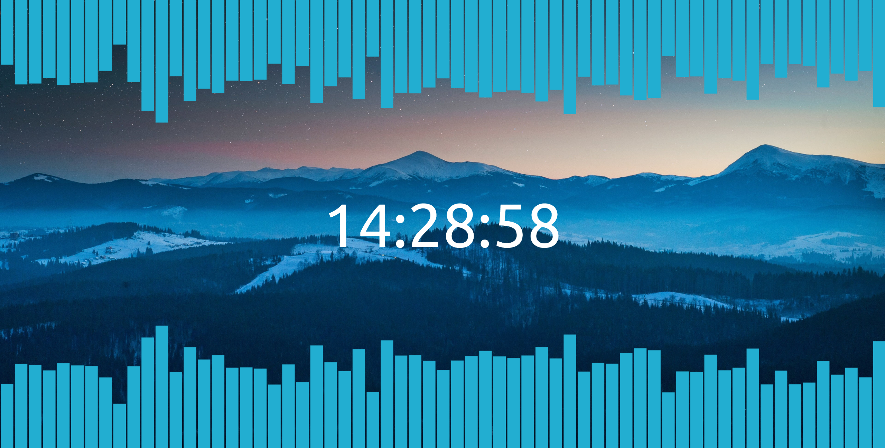

# Scene - A live wallpaper for Wallpaper Engine

This is a wallpaper with audio visualizers I built for Wallpaper Engine.



The wallpaper is built with React and runs as a html page.

### Build it yourself

These are the system requirements for building the React App.

- Node  10.14+
- Yarn
- Git

```bash
git clone http://github.com/supergrecko/scene
yarn install
yarn build
```

The final build is now in the `build` folder along with a `project.json` file which you'll be importing into Wallpaper
Engine.

**Build Options**

By default, the wallpaper expects to be placed in the directory `/home/wallpapers/live`. To change this location, edit
the `"homepage"` field in [package.json](package.json).

**Hacking with the wallpaper**

The application is a React app, created from [`create-react-app`](https://create-react-app.dev/). To get started working
on the wallpaper, run `yarn start`. This will open a development build at [`localhost:3000`](http://localhost:3000)

In the [src/hooks/useAudioFeed.ts](src/hooks/useAudioFeed.ts) there is a React hook which will fetch the audio stream
from Wallpaper Engine. When running in development mode, it will use mocked numbers as the browser doesn't have access
to the audio stream.

**License**

[MIT License](LICENSE)